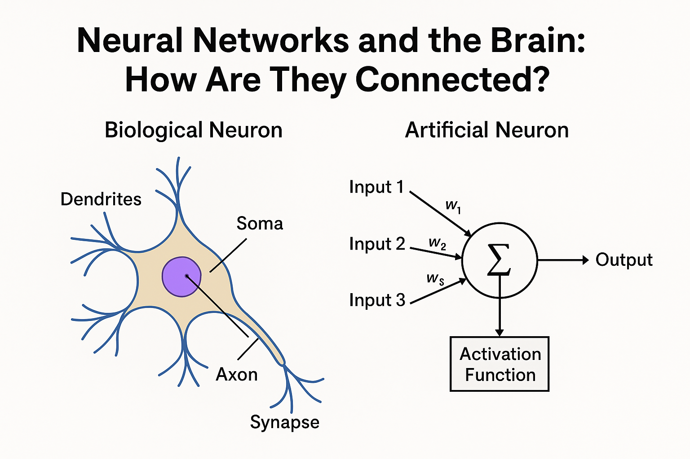

Great question! Understanding the connection between a **neural network** and the **human brain** helps clarify why it's called a "neural" network in the first place.

---

## 🧠 Biological Brain vs. 🖥️ Artificial Neural Network

| **Biological Brain**                          | **Artificial Neural Network (ANN)**                                            |
| --------------------------------------------- | ------------------------------------------------------------------------------ |
| Contains billions of **neurons**              | Contains units called **artificial neurons (nodes)**                           |
| Neurons connect via **synapses**              | Neurons connect via **weights** between layers                                 |
| Neuron fires when signal passes a threshold   | Neuron activates when weighted sum passes through an **activation function**   |
| Learning occurs by adjusting synapse strength | Learning occurs by adjusting **weights** using algorithms like backpropagation |
| Signals are electrical and chemical           | Signals are **numerical values**                                               |

---

### üî∂ How Are They Similar?

1. **Neurons and Nodes**:

   * In the brain, a neuron receives signals from others and decides whether to "fire".
   * In a neural network, a node receives inputs, multiplies them by weights, adds a bias, and applies an activation function.

2. **Connections and Weights**:

   * The **strength of a synapse** in the brain affects how strong a signal is passed.
   * In ANNs, **weights** play the same role.

3. **Learning**:

   * Brains strengthen or weaken connections through experience.
   * ANNs learn by adjusting weights during training using data.

---

### üî∂ Visual Analogy

```
Biological Neuron:
   Dendrites ‚Üí Cell Body ‚Üí Axon ‚Üí Synapse ‚Üí Next Neuron

Artificial Neuron:
   Inputs ‚Üí Weighted Sum + Bias ‚Üí Activation Function ‚Üí Output
```

---

### üî∂ Key Differences

* The **brain is massively parallel**, has high adaptability, and is energy-efficient.
* ANNs are **simplified mathematical models** — they mimic some **ideas**, not the full complexity of the brain.

---

### üî∂ Why Use the Term "Neural Network"?

Because:

* It **mimics the structure** of brain-like learning.
* It **learns from data** by adjusting internal "connections" (weights).
* It captures the **idea** of learning through trial, error, and adaptation — just like a brain does.

---

Would you like a diagram or code example to visualize this analogy?
---
Great follow-up — those are key parts of a **biological neuron**, and we can directly relate them to parts of an **artificial neuron** to deepen the analogy.

---

### 🧠 Biological Neuron Structure vs. Artificial Neuron

| **Biological Neuron Part** | **Function in Brain**                                   | **Equivalent in Neural Network**                          |
| -------------------------- | ------------------------------------------------------- | --------------------------------------------------------- |
| **Dendrites**              | Receive input signals from other neurons                | **Input values (features)**                               |
| **Cell Body (Soma)**       | Processes inputs, integrates the signal                 | **Weighted sum + bias calculation**                       |
| **Nucleus**                | Controls cell’s internal operations (genetic blueprint) | No exact equivalent; resembles **model structure/config** |
| **Axon**                   | Sends the output signal to other neurons                | **Output of the activation function**                     |
| **Synapse**                | Connection between neurons; strength determines signal  | **Weight between neurons**                                |

---

### üî∂ Mapping It Visually

```
Biological Neuron           Artificial Neuron
------------------          ---------------------
Dendrites        ‚Üí          Inputs (x‚ÇÅ, x‚ÇÇ, x‚ÇÉ...)
Cell Body        ‚Üí          Weighted sum: w‚ÇÅx‚ÇÅ + w‚ÇÇx‚ÇÇ + ... + b
Activation       ‚Üí          Activation function (e.g., ReLU, sigmoid)
Axon             ‚Üí          Output of neuron (passed to next layer)
Synapse strength ‚Üí          Weight values (adjusted during learning)
```

---

### üìò Possible Title (Updated)

If you want a title that includes these parts:

* **"From Dendrites to Axons: Understanding Neural Networks Through the Brain"**
* **"Neural Networks Explained with Brain Anatomy: Dendrites, Axons, and Beyond"**
* **"How Artificial Neurons Mirror Brain Cells: Dendrites, Soma, and Synapses"**

Would you like a labeled diagram comparing these side-by-side?
-----

Great — you're doing exactly what you should: trying to **connect ideas between biology and machine learning**.

Let’s walk through the two tables together, so you see how **both are just different levels of analogy**:

---

### üî∑ **Table 1: Brain vs. Neural Network (High-Level Concepts)**

| **Biological Brain**                           | **Artificial Neural Network (ANN)**                                 |
| ---------------------------------------------- | ------------------------------------------------------------------- |
| Billions of **neurons**                        | Units called **artificial neurons (nodes)**                         |
| Neurons connect via **synapses**               | Nodes connect via **weights**                                       |
| A neuron **fires** if signal exceeds threshold | A node **activates** if the weighted sum passes activation function |
| Brain **learns** by changing synapse strength  | ANN **learns** by updating weights (via backpropagation)            |
| Signals are **electrochemical**                | Signals are **numerical** (numbers, vectors)                        |

‚úÖ This table helps you see how the **overall idea** of brain-like learning is **translated into math** in artificial networks.

---

### üî∑ **Table 2: Biological Parts vs. ANN Parts (Structural Analogy)**

| **Biological Neuron Part** | **Function in Brain**               | **Equivalent in Neural Network**         |
| -------------------------- | ----------------------------------- | ---------------------------------------- |
| **Dendrites**              | Receive signals from other neurons  | Inputs/features (x‚ÇÅ, x‚ÇÇ, ...)            |
| **Cell Body (Soma)**       | Processes those inputs              | Weighted sum: `w‚ÇÅx‚ÇÅ + w‚ÇÇx‚ÇÇ + ... + b`    |
| **Nucleus**                | Runs the cell, decides how it works | Overall architecture/config (optional)   |
| **Axon**                   | Sends processed signal onward       | Output from the activation function      |
| **Synapse**                | Connection strength between neurons | Weight values between artificial neurons |

‚úÖ This table zooms into a **single neuron**, comparing **biological parts** to **parts in a single artificial node**.

---

### üî∂ Putting It All Together

* Think of the **first table** as the big-picture view — comparing **whole networks**.
* Think of the **second table** as zooming in — looking **inside one neuron** to see how it processes information.

---

### üåü A Simple Analogy

If you imagine:

* A neural network = a "brain"
* A single node = a "neuron"
* Weight = strength of a connection (like a synapse)
* Activation function = firing rule (like in biology)

Then you’re seeing how machine learning **borrows from nature**, but makes it **computable**.

Would a diagram of both perspectives help you even more?
---

In the image above (titled **"Neural Networks and the Brain: How Are They Connected?"**), here's where the **neurons** are represented:

---

### 🧠 Left Side: **Biological Brain**

* The **entire structure** is a **single biological neuron**.
* It includes:

  * **Dendrites**: the blue tree-like branches that **receive signals**.
  * **Cell Body (Soma)**: where signals are processed.
  * **Nucleus**: center of control (inside the soma).
  * **Axon**: long tail that **sends the signal forward**.
  * **Synapse**: connection to the next neuron.

🟢 This is one **neuron**, but in reality, many such neurons are connected together — this image just shows one for simplicity.

---

### 🖥️ Right Side: **Artificial Neuron**

* This is **also a single artificial neuron**.
* It shows:

  * Multiple **Inputs** (like dendrites).
  * A **Weighted Sum** (like the soma).
  * An **Activation Function** (like the neuron deciding to "fire").
  * An **Output** (like the axon/synapse sending signal to next neuron).

🟢 Again, it’s just one neuron in the diagram. In a real neural network, **many such neurons are connected into layers**.

---

Would you like me to generate a follow-up diagram showing **multiple neurons connected in layers** (input ‚Üí hidden ‚Üí output)?

